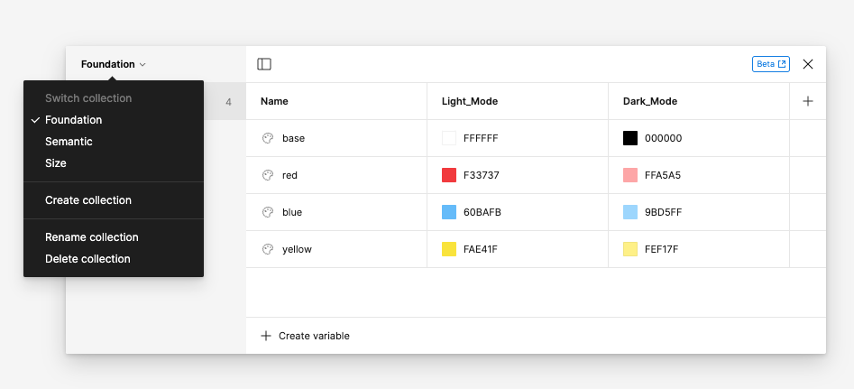

# Style Dictionary Demo

Demo for Style Dictionary. The tokens are generated using [Style Dictionary](https://amzn.github.io/style-dictionary/#/). The raw JSON data is exported from Figma using [this figma plugin](https://www.figma.com/community/plugin/1256972111705530093). 

## How it works

1. Variable Collections are created in Figma
2. Variables are exported to JSON via [this figma plugin](https://www.figma.com/community/plugin/1256972111705530093)
3. The `style-dictionary.config.json` files acts as a manifest where you can define whatever types of formats you want. [Official docs.](https://amzn.github.io/style-dictionary/#/)
4. The `style-dictionary.actions.js` contain the intructions for the manifest.

### Token Lifecycle

The path from Figma to token code is outlined below
* JSON files are read from `./Exported_Figma_Tokens` and passed through the `StyleDictionary.registerParser` function. Here, the JSON is reshaped into something Style Dictionary can understand.
* The new JSON data is run through the `StyleDictionary.registerFilter` to determine what part of the data to process.
* The data is then transformed via the `registerTransformGroup` rules. Here, token names and values can be modified. 
* Finally, a custom format takes the data and outputs whatever files you like.

## Get started

1. `git clone git@github.com:andreortiz82/style-dictionary-demo.git`
2. `cd style-dictionary-demo/`
4. `npm install`
3. `npm run build`